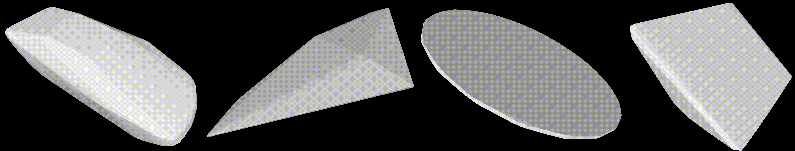

# Neural Vector Fields (NVF):



Official implementation of Neural Vector Fields (NVF). Feel free to use this code for academic work, but please cite the following:
```
@misc{yang2023neural,
      title={Neural Vector Fields: Implicit Representation by Explicit Learning}, 
      author={Xianghui Yang and Guosheng Lin and Zhenghao Chen and Luping Zhou},
      year={2023},
      eprint={2303.04341},
      archivePrefix={arXiv},
      primaryClass={cs.CV}
}
```
[Paper]() -
[Supplementaty]() -
[Arxiv](https://arxiv.org/abs/2303.04341) -
Published in CVPR 2023.

## Requirements
The codes have been tested on the linux Ubuntu 20.04 system with NVIDIA RTX3090ti. The enviroment inlcude:
* Python=3.9
* Pytorch=1.12.1
* Torchvision=0.13.1
* CUDA=11.6
  
Please clone the repository and navigate into it in your terminal, its location is assumed for all subsequent commands.

## Installation
The nvf.yml file contains all necessary python dependencies for the project. You can conveniently create the environment. 
```
conda env create -f nvf.yml
conda activate nvf
```
To train the model, relavattive operations in point-transfomrer are needed. To extract meshes, meshUDF is needed. To test the model, pytorch3D, chamfer distance, earth mover distance are needed. 
The commands have been incorperated into create_env.sh. You install them with anaconda via runing the script:
```
bash create_env.sh
```
## Data Preparation
First, create a configuration file in folder configs/, use configs/shapenet_cars.txt as reference and see configs/config_loader.py for detailed explanation of all configuration options. Change the dirseired save dirctory in using `SAVE_DIR` in `create_split_generalization.py`, `convert_to_scaled_off.py ` and `boundary_sampling.py`.

Next, prepare the data for NVF using
```
python dataprocessing/preprocess.py --config configs/shapenet_cube_offset_generalization_pt_vq_k16.txt
```
and generate a random test/training/validation split of the data using
```
python dataprocessing/create_split.py --config configs/shapenet_cube_offset_generalization_pt_vq_k16.txt
```
but replacing configs/shapenet_cube_offset_generalization_pt_vq_k16.txt in the commands with the desired configuration.

## Training
To train your NVF, you can change the parameters in the configs and run:
```
python train_generalization.py --config ./configs/${exp_name}.txt 2>&1|tee ${save_dir}/log.txt
```
In the experiments/ folder you can find an experiment folder containing the model checkpoints, the checkpoint of validation minimum, and a folder containing a tensorboard summary, which can be started at with
```
tensorboard --logdir experiments/EXP_NAME/summary/ --host 0.0.0.0
```
## Generation
```
python generation.py
```
## Test
```
python test.py
```

## Contact
For questions and comments please leave your questions in the issue or contact Xianghui Yang via mail xianghui.yang@sydney.edu.au.

## Acknowledge
The code is modified from the [NDF](https://github.com/jchibane/ndf).

